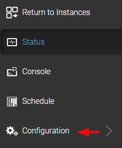
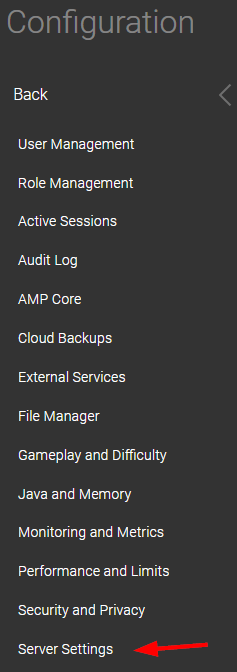

# Notes about fixes on minecraft servers hosted on AMP

## 1. Cannot connect to running server

Some servers may experience running but no users being able to connect,

check the console:

And check if the following is located in the log:

If so, a fix is to disable 'Use-Native-Transport' option on the server, this option

Go to `configuration/Server Settings`

And ensure that this option is disabled:

Now restart the server, and connect to the server.
