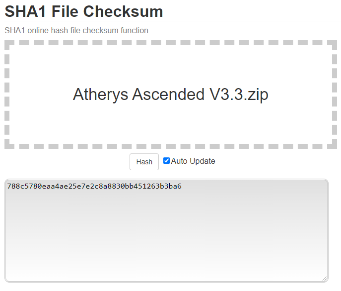

# Notes about minecraft servers hosted on AMP

## Setup Resource pack on server

Go to server settings

`configuration/Server Settings`

1. Insret the direct download url for the resource pack into `Resource Pack URL`

2. The 2nd field `Resource Pack Hash` is for a [SHA1 hash](https://brilliant.org/wiki/secure-hashing-algorithms/) of the resource pack.
   This is used by the client to verify that it has downloaded the correct file.

To calculate the SHA1 hash do the following:

1. Download the resource pack
2. Go to [SHA1 File Checksum](https://emn178.github.io/online-tools/sha1_checksum.html)
3. Upload the resource pack to the site
4. The resulting seemingly random string of letters and numbers is the SHA1 hash, and should be copied to the `Resource Pack Hash` field

---

# Troubleshooting

## 1. Cannot connect to running server

Some servers may experience running but no users being able to connect,

check the console:

And check if the following is located in the log:

If so, a fix is to disable 'Use-Native-Transport' option on the server, this option

Go to `Configuration/Server Settings`

And ensure that this option is disabled:

Now restart the server, and connect to the server.

---